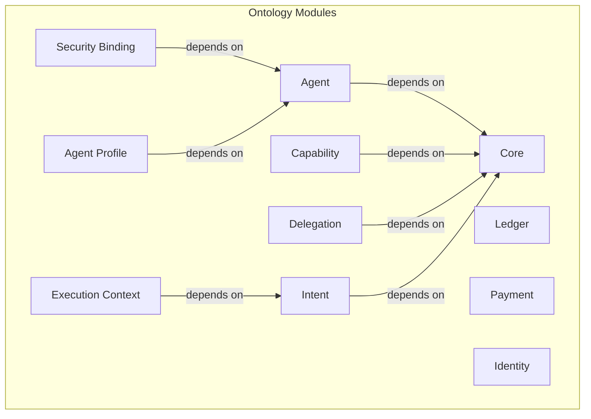

# W3C Semantic Agent Communication Community Group: Agent Semantic Communication Ontology

This repository contains the draft of formal ontology for AI Agent interoperability, security, and communication, developed as part of the **W3C Agent Semantic Communication Community Group** work. It provides a machine-readable, logically consistent framework for defining agents, their capabilities, and the rules governing their interactions.

This CG defines the semantic meaning of agent interactions, not the transport, execution, or reasoning mechanisms used to process them.

## Vision and Goals

Our vision is to create a universal standard for safe and effective semantic communication among AI agents. This ontology serves as the foundational layer for a future where agents can securely delegate tasks, exchange value, and collaborate across different platforms and ecosystems.

**Key Goals:**
-   **Interoperability:** Define a shared vocabulary that allows agents from different developers to understand each other.
-   **Protocol-Agnostic:** Focus on the **semantic payload** of communication, ensuring the ontology can be used over any network protocol (HTTP, WebSockets, etc.) and is independent of specific agent implementations (e.g., LLMs).
-   **Security:** Anchor digital trust in physical reality by enabling agent identities and actions to be bound to hardware attestation, moving beyond purely digital security guarantees.
-   **Verifiability:** Create a complete, auditable chain of responsibility from intent to execution, providing the foundation for automated compliance, online arbitration, and system self-regulation.
-   **Extensibility:** Provide a modular core that can be extended to support diverse applications and domains.

---

## High-Level Architecture

The ontology is designed as a collection of modular, interconnected components. The `core` ontology provides the fundamental concepts, upon which other modules for agent identity, capabilities, security, and more are built.

The main entry point for the entire model is [`ontologies/ontology.ttl`](./ontologies/ontology.ttl), which imports all the necessary modules.

---

## How to Use

To use the complete ontology, we recommend loading the main entry point file in your preferred tool (e.g., Protégé for visualization, or an RDF library for programmatic access).

-   **Main Ontology File:** [`ontologies/ontology.ttl`](./ontologies/ontology.ttl)

This single file uses `owl:imports` to load the entire modular architecture, giving you access to all classes and properties.

### Validation
The repository includes a suite of [SHACL shapes](./tests/) to validate data created against the ontology. Our CI pipeline automatically runs these tests.

---

## Examples and Use Cases

To understand the practical application of this ontology, we provide two key examples in the [`ontologies/examples/`](./ontologies/examples/) directory.

### 1. W3C CG Auto-Operations Agent (Theoretical Blueprint)

-   **Directory:** [`w3c-cg-auto-operations-agent/`](./ontologies/examples/w3c-cg-auto-operations-agent/)
-   **What it is:** A comprehensive, real-world use case demonstrating how to model a sophisticated agent for managing a W3C Community Group. It serves as a theoretical blueprint for designing robust, auditable, and secure administrative agents.
-   **Key Concepts Shown:** This example covers the full spectrum of the ontology, including detailed agent profiles, multi-step actions, delegation of authority, and security bindings for signing artifacts.

### 2. Minimal Runnable CLI Agent (Practical Prototype)

-   **Directory:** [`minimal_agent_cli/`](./ontologies/examples/minimal_agent_cli/)
-   **What it is:** A minimal, hands-on, and **runnable** Python example that demonstrates the core feedback loop of a governed autonomous agent.
-   **How it works:** It connects the static ontology definitions (Agent Profile, Delegation) with a dynamic Large Language Model (LLM), allowing you to give it natural language commands via a command-line interface (CLI). The agent then uses the ontology as its "world model" to reason about your intent, decide on an action, and execute it.
-   **Purpose:** This example is designed to give developers a tangible starting point for building their own agents, showcasing the "last mile" of how the ontology comes to life when paired with an LLM.

---

## Practical Application: Managing this Project with the Ontology

The "W3C CG Auto-Operations Agent" use case, detailed in [`ontologies/examples/w3c-cg-auto-operations-agent/README.md`](./ontologies/examples/w3c-cg-auto-operations-agent/README.md), serves as a powerful demonstration of how this Agent Ontology can be applied to manage a community group or, indeed, this very project itself.

We can envision an `OntologyBot` agent, built upon this ontology, to automate various administrative tasks for the `agent-ontology` project:

*   **Issue Monitoring & Triage:** Automatically monitor GitHub issues, categorize them (e.g., `agenda-request`, `bug`, `feature`), and assign labels based on content analysis.
*   **Automated Ontology Validation:** Trigger SHACL validation checks on new ontology file submissions (e.g., in Pull Requests) and report results directly as PR comments, ensuring data quality and adherence to defined shapes.
*   **Meeting Agenda Drafting:** Periodically scan for `agenda-request` issues and automatically compile a draft meeting agenda, submitting it as a Pull Request for review.
*   **Meeting Minutes Publication:** Facilitate the formal publication of meeting minutes, potentially including cryptographic signing by the agent to ensure authenticity and integrity, and archiving them within the project's `discussions/` directory.

This "dogfooding" approach highlights the practical utility of the Agent Ontology in creating transparent, auditable, and efficient autonomous administrative systems.

---

## Key Specifications

The behavior and design of this ontology are guided by several key specification documents.

-   **Minimal Threat Model ([`specs/minimal-threat-model.md`](./specs/minimal-threat-model.md)):** This is a critical document that outlines the security threats the ontology is designed to mitigate. It is essential reading for understanding the "why" behind many of the security-related components.
-   **Core Ontology Concepts ([`specs/core-ontology.md`](./specs/core-ontology.md)):** Describes the foundational classes and properties.

---

## Contributing

We welcome contributions from the community! Please read our [`CONTRIBUTING.md`](./CONTRIBUTING.md) file to learn how you can get involved, whether it's by improving the ontology, adding examples, or enhancing the documentation.
