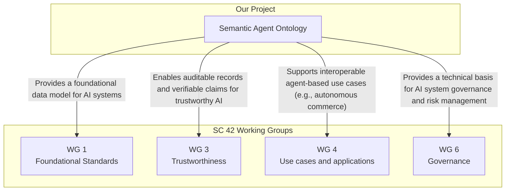

# Project Roadmap: From W3C Community Group to ISO/IEC JTC 1 Fast Track

**Document Status:** Draft  
**Version:** 0.1

## 1. Introduction

This document outlines the strategic roadmap for the Semantic Agent Ontology project. The goal is to mature the specifications within a W3C Community Group and subsequently submit them to ISO/IEC JTC 1 for formal international standardization via the Fast Track procedure.

This roadmap is designed to maximize community involvement, technical robustness, and global adoption.

## 2. Phase 1: W3C Community Group Incubation (Current Phase)

This is the current, foundational phase of the project.

- **Primary Goals:**
  - **Develop and Stabilize the Ontology:** Collaboratively refine the core ontology, schemas, and context files until they reach a stable, version 1.0 state.
  - **Build a Community:** Attract a diverse group of stakeholders, including OS developers, AI researchers, enterprise users, and regulatory experts.
  - **Gather Implementation Experience:** Use the **AI Workforce OS** as a reference implementation to validate the practicality and correctness of the specification. Encourage other independent implementations.

- **Key Deliverables:**
  - Stable Version 1.0 of the Ontology and associated specifications.
  - A comprehensive test suite (SHACL and other validation tools).
  - A portfolio of use cases and implementation reports.
  - A final W3C Community Group Report summarizing the work and its readiness for formal standardization.

## 3. Phase 2: W3C Recommendation Track (Optional but Recommended)

Upon successful completion of Phase 1, the group may choose to charter a formal W3C Working Group to advance the specification to a W3C Recommendation.

- **Benefits:**
  - A W3C Recommendation carries significant weight and indicates broad consensus from industry leaders.
  - The formal W3C process provides a rigorous framework for review, patent policy management, and internationalization.

## 4. Phase 3: ISO/IEC JTC 1 Fast Track Submission

This is the primary goal for formal international standardization.

- **Process:**
  - Under the existing agreement between W3C and ISO/IEC JTC 1 (the Joint Technical Committee for Information Technology), a mature W3C Recommendation or a similar stable specification can be submitted to the JTC 1 "Fast Track" process.
  - The specification is submitted to ISO/IEC national bodies for a ballot. If approved, it becomes a formal ISO/IEC International Standard.

- **Advantages:**
  - **Speed:** The Fast Track process is significantly faster than developing a standard from scratch within ISO.
  - **Global Reach:** An ISO/IEC standard has global recognition and is often adopted or referenced in national regulations and public procurement.

## 5. Alignment with ISO/IEC JTC 1/SC 42 (Artificial Intelligence)

Our work is strategically aligned with the mandate of SC 42, the ISO/IEC subcommittee for AI. The following diagram illustrates how the Semantic Agent Ontology contributes to several of its key Working Groups (WGs).

## 6. New Work Item Proposal (NWIP)

A critical step for the ISO process is the submission of a New Work Item Proposal (NWIP). A draft of this document is being prepared and can be found in `specs/iso-nwip-draft.md`.

This NWIP will serve as the formal proposal to ISO/IEC JTC 1, outlining the scope, purpose, and business case for standardizing this ontology. We will develop this document in parallel with the technical work to ensure a smooth transition to Phase 3.
